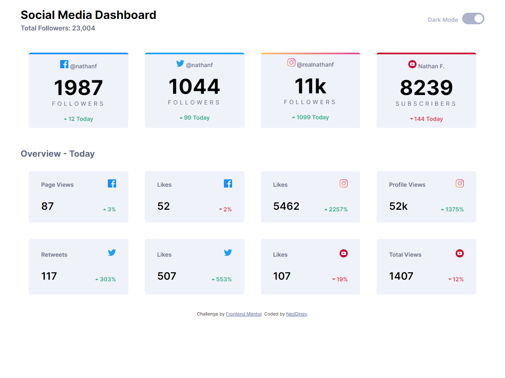
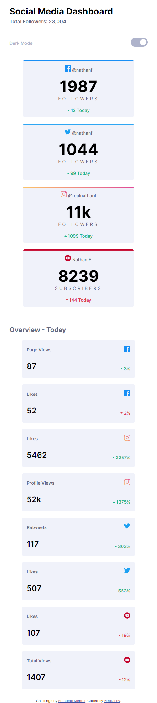
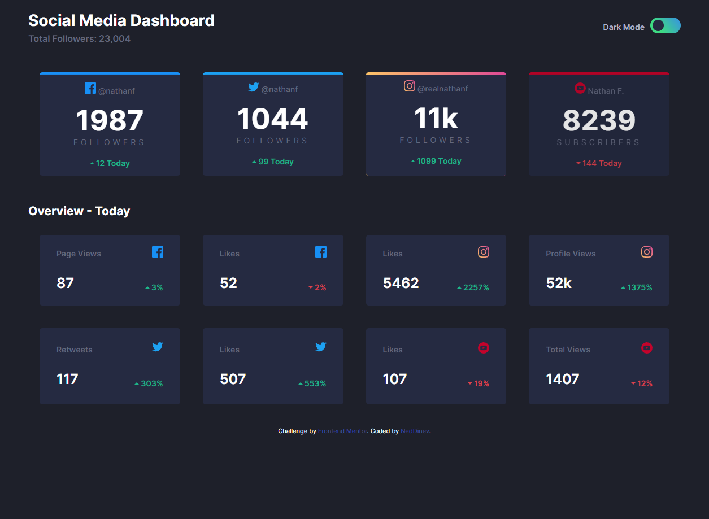

# Frontend Mentor - Social media dashboard with theme switcher solution

This is a solution to the [Social media dashboard with theme switcher challenge on Frontend Mentor](https://www.frontendmentor.io/challenges/social-media-dashboard-with-theme-switcher-6oY8ozp_H). Frontend Mentor challenges help you improve your coding skills by building realistic projects. 

## Table of contents

- [Overview](#overview)
  - [The challenge](#the-challenge)
  - [Screenshot](#screenshot)
  - [Links](#links)
- [My process](#my-process)
  - [Built with](#built-with)
  - [Useful resources](#useful-resources)
- [Author](#author)

## Overview

### The challenge

Users should be able to:

- View the optimal layout for the site depending on their device's screen size
- See hover states for all interactive elements on the page
- Toggle color theme to their preference

### Screenshot

### Links

- Solution URL: [Github](https://your-solution-url.com)
- Live Site URL: [Vercel](https://social-media-dashboard-with-theme-switcher-master-peach.vercel.app/)

## My process

### Built with

- Semantic HTML5 markup
- SASS
- Flexbox
- Desktop-first workflow
- Vanilla JS

### Useful resources

- [Linear-gradient border](https://dev.to/afif/border-with-gradient-and-radius-387f) - This helped me with the Instagram card top liner-gradient border.

## Author
- Frontend Mentor - [@neddinev](https://www.frontendmentor.io/profile/neddinev)
- Instagram - [@neddinev](https://www.instagram.com/neddinev)
